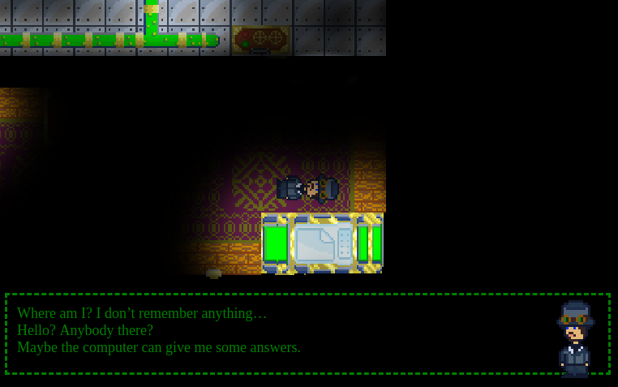
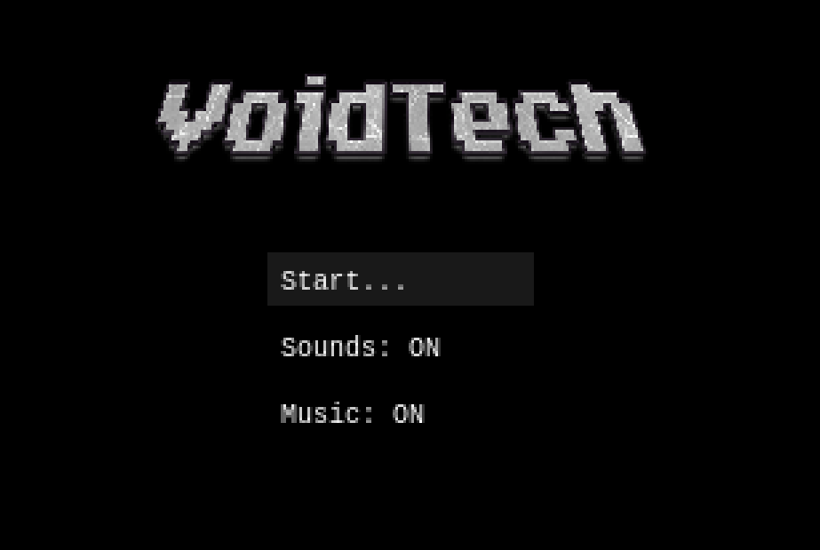
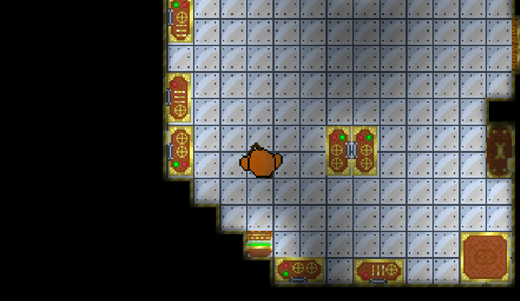
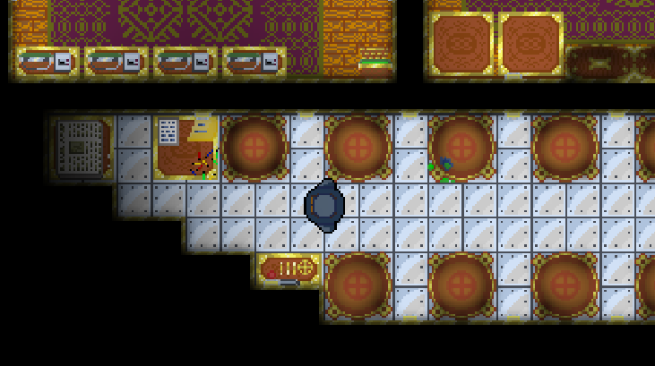

This repository is archived (readonly) to be a snapshot of the actual Ludum Dare 45 contribution. You can find the active version of it here: https://github.com/drusin/ViodTech_plus

# VoidTech
This was an entry for Ludum Dare 45.

What would you do if you woke up in a dark room, remembering nothing? Only the glow of a computer screen hinting at your next step. Can you gather something from the nothingness? Join Dave on a quest of discovery where your actions mean everything.

To play: https://drusin.github.io/VoidTech/

PS: Make sure to explore a bit after you are done with your job!

*Scripts:*  
`npm start`: starts a dev server  
`npm run build`: builds the project to dist/ (no tracked by git)  
`npm run pages`: builds the project to docs/ for github pages.  
